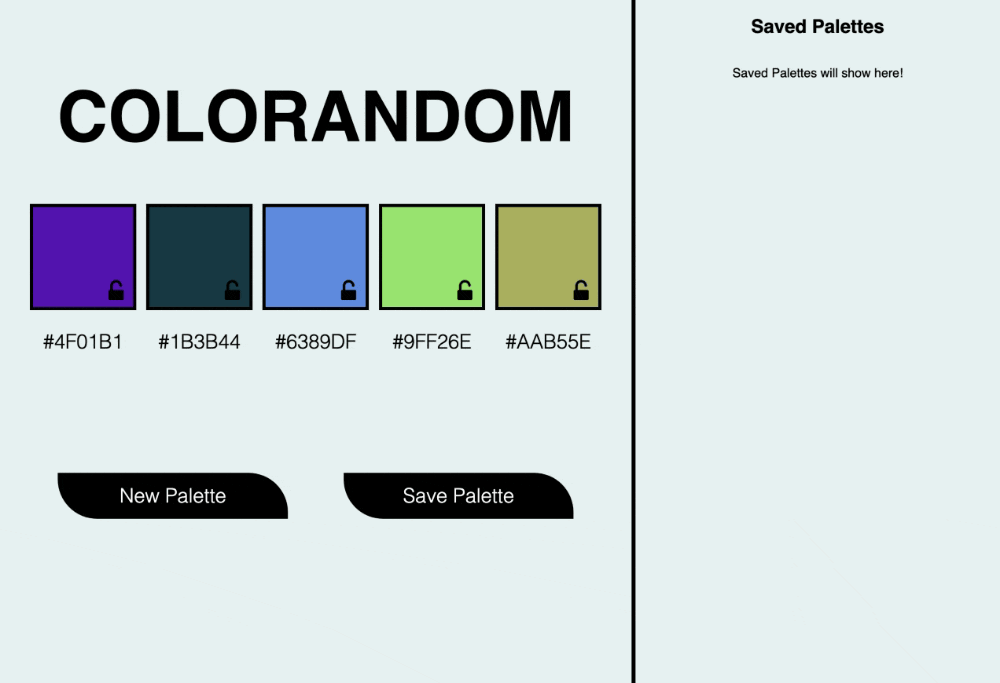

# 🎨 [ColorRandom](https://CarissaHluchan.github.io/colorRandom/) 🎨

☝️ Click the link for a working deployment of this repo.

### Abstract:
[//]: <> (Briefly describe what you built and its features. What problem is the app solving? How does this application solve that problem?)

Our team built a site that generates color palettes for its users. Similar to other sites like [coolors](https://coolors.co/generate), the site presents users with various random colors which they can choose to “save” (note: saved palettes will not persist across page refreshes). Users can “lock” a color, which will keep that color when a new palette is generated.

This project gave our team an opportunity to write HTML and CSS, and leverage JavaScript to both create the data model and interact with the DOM.
### Installation Instructions:
[//]: <> (What steps does a person have to take to get your app cloned down and running?)

- Fork this project to your own Github account.
- Clone the repository to your local machine.
- `cd` into the project folder.
- Use the `open index.html` command to view the webpage.

### Preview of App:
[//]: <> (Provide ONE gif or screenshot of your application - choose the "coolest" piece of functionality to show off.)

##### Desktop View

##### Mobile View

### Context:
[//]: <> (Give some context for the project here. How long did you have to work on it? How far into the Turing program are you?)
Our team of 4 Front-End Developers completed this project while in the 4th week of an intensive Software Development Bootcamp. Before touching any code, as a group we looked over the provided site comp and [brainstormed](./assets/coloRandomBrainStorm.png) how to store our data using JS variables. It took us 4 days of group work and collaboration to complete. We tracked our team's progress using a [github project board](./assets/coloRandomProjectBoard.png).

### Contributors:
[//]: <> (Who worked on this application? Link to their GitHubs.)
Created by [Carissa Hluchan](https://github.com/CarissaHluchan), [Marshall Hotaling](https://github.com/marshallhotaling), [Robert Phillips](https://github.com/Robert-phillips33) & [Seth Way](https://github.com/seth-way).

### Learning Goals:
[//]: <> (What were the learning goals of this project? What tech did you work with?)

- Write semantic HTML and efficient CSS to form a usable UI.
- Write clean, DRY JavaScript and leverage functions, creating and using an effective data model.
- Manipulate the page after it has loaded adding, removing, and updating elements on the DOM.
- Refine our group collaboration skills.
- Project specifications can be found [here](https://frontend.turing.edu/projects/module-1/colorandom.html).

### Wins + Challenges:
[//]: <> (What are 2-3 wins you have from this project? What were some challenges you faced - and how did you get over them?)
- We worked with CSS @media selectors to make this app responsive to mobile devices.
- We experimented with new CSS @keyframe animations to create a more interactive user experience.
- We used our knowledge of the event propagation cycle to dynamically capture user events from parent containers.
  - This allowed us to capture events for DOM nodes that will be added and removed by user interactions.
